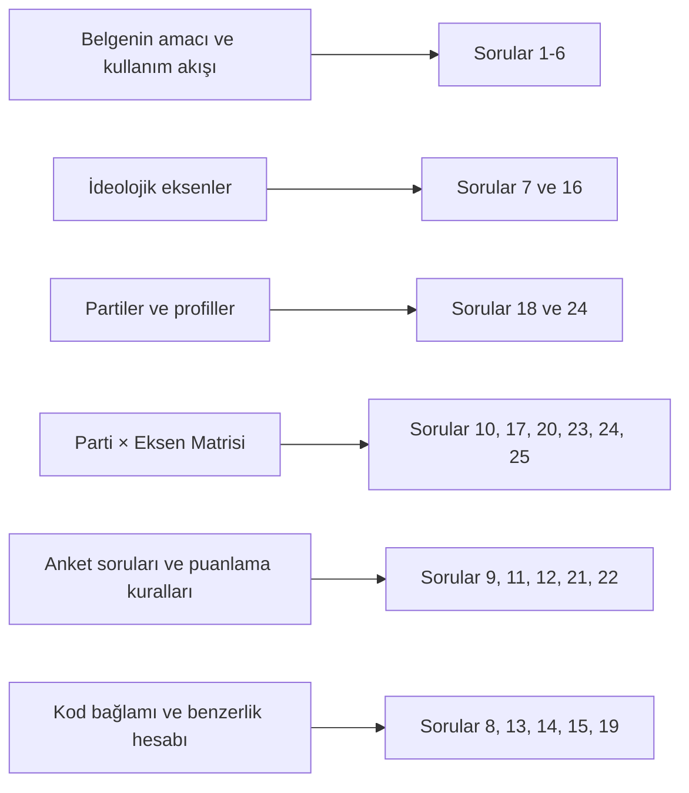

# Yüklenen Türkçe Belgeye Dayalı Ölçme ve Değerlendirme Raporu

## Yönetici Özeti

Yüklenen metin, klasik anlamda açıklayıcı bir makale değil; “Oy Ver Gitsin” adlı siyasi eşleşme platformu için hazırlanmış, veri doldurma ve uygulama bütünlüğü odaklı bir araştırma girdisidir. Belgenin açık amacı, uygulamadaki mevcut **placeholder/dummy** verileri gerçek, güncel ve kaynaklı verilerle değiştirmektir; özellikle parti pozisyonlarının rastgele atandığı ve mevcut 25 soruluk setin gerçek anket içeriği değil, yalnızca soru tiplerini örneklemek için kullanıldığı özellikle belirtilir. fileciteturn0file0L3-L8

Belge, işi dört ana üretim bloğuna ayırır: ideolojik eksenlerin tanımlanması, partilerin güncel profillerinin yazılması, 12 parti ile 10 eksen arasındaki **120 hücrelik** pozisyon matrisinin doldurulması ve eksenleri ölçen yeni anket sorularının üretilmesi. Buna ek olarak, kod bağlamı bölümünde puanların eksen bazında toplandığı, sonuçların `[-100,100]` aralığına sıkıştırıldığı ve parti benzerliğinin `100 - ortalama(|kullanıcı_skoru - parti_skoru|)` formülüyle hesaplandığı anlatılır. fileciteturn0file0L25-L110 fileciteturn0file0L114-L188 fileciteturn0file0L192-L236 fileciteturn0file0L242-L245

Bu nedenle aşağıda sunulan değerlendirme, yalnızca yüzeysel bilgi hatırlamayı değil; şema disiplinini, talimat takibini, uygulama mantığını, hesaplamayı, kaynak kullanımını, tarafsızlık ilkesini ve metodolojik muhakemeyi de ölçmek üzere tasarlanmıştır. Belge fiilen sağlandığı için, “belge verilmezse şablon üret” senaryosu uygulanmamış; tüm sorular doğrudan bu yüklenen belge üzerine kurulmuştur. fileciteturn0file0L12-L21 fileciteturn0file0L253-L257

## Belgeye Dayalı Tasarım Esasları

Belgede açık başlıklar halinde yazılmış “öğrenme hedefleri” bulunmuyor; dolayısıyla aşağıdaki hedefler belgenin talimat yapısından **türetilmiştir**. Bu nedenle öğrenme hedefleri durumu “belgede açıkça belirtilmemiş; içerikten çıkarılmıştır” şeklinde değerlendirilmelidir. fileciteturn0file0L12-L21 fileciteturn0file0L108-L110 fileciteturn0file0L135-L138 fileciteturn0file0L178-L188 fileciteturn0file0L212-L236

| Tasarım unsuru | Değer |
|---|---|
| Değerlendirme dili | Türkçe |
| Belge durumu | Sağlanmış; değerlendirme doğrudan yüklenen metne dayalı |
| Toplam soru | 25 |
| Zorluk dağılımı | Yaklaşık 6 kolay, 10 orta, 9 zor |
| Toplam süre | 110 dakika |
| Toplam puan | 100 puan |
| Zorunlu soru tipleri kapsanımı | Çoktan seçmeli, doğru/yanlış, kısa cevap, boşluk doldurma, eşleştirme, sıralama, deneme, vaka/problem çözme, hesaplama, diyagram etiketleme, açık uçlu eleştirel düşünme |
| Harici doğrulama | Gerekmedi; değerlendirme yalnızca yüklenen doküman içeriğini ölçüyor |

### Türetilmiş öğrenme hedefleri

| Kod | Türetilmiş öğrenme hedefi |
|---|---|
| ÖH-A | Belgenin amacını, mevcut veri sorununu ve kullanım akışını açıklamak |
| ÖH-B | Dört ana veri bloğunu ve bunların şema/talimat kısıtlarını ayırt etmek |
| ÖH-C | Parti, eksen ve soru üretimi arasındaki bağı uygulama düzeyinde yorumlamak |
| ÖH-D | Skorlama, clamp ve similarity formülünü doğru uygulamak |
| ÖH-E | Kaynak hiyerarşisi, belirsizlik yönetimi ve tarafsızlık ilkelerini değerlendirmek |
| ÖH-F | Belgeye uygun kalite güvencesi ve denetlenebilirlik çerçevesi önermek |

Aşağıdaki akış, soru setinin belge bölümlerine nasıl dağıtıldığını özetler:



Bu dağılım, belgenin yalnızca içerik değil, aynı zamanda veri modeli, üretim talimatı ve uygulama mantığı taşıyan hibrit bir metin olduğunu yansıtır. fileciteturn0file0L25-L110 fileciteturn0file0L114-L188 fileciteturn0file0L192-L245

## Sınav Soruları

Aşağıdaki 25 soru, basitten karmaşığa doğru ilerler; önce amaç ve yapı, sonra uygulama mantığı, en sonda da analitik ve eleştirel değerlendirme becerileri ölçülür.

1. **Çoktan seçmeli | Kolay | 2 dk | 2 puan**  
   Belgenin temel amacı aşağıdakilerden hangisidir? fileciteturn0file0L3-L8  
   A) Uygulamadaki placeholder/dummy verileri gerçek, güncel ve kaynaklı verilerle değiştirmek  
   B) Sadece parti renk paletini yeniden tasarlamak  
   C) Parti sayısını azaltarak veri modelini sadeleştirmek  
   D) Uygulamaya zorunlu captcha sistemi eklemek

2. **Doğru/Yanlış | Kolay | 2 dk | 2 puan**  
   `scripts/seed.js` içindeki mevcut 25 soru, belgeye göre zaten gerçek siyasi anket içeriğidir. fileciteturn0file0L194-L196

3. **Boşluk doldurma | Kolay | 2 dk | 2 puan**  
   JSON yapısında key/id bütünlüğünü korumak için özellikle `_____` ve `_____` alanlarının bozulmaması istenir. fileciteturn0file0L20-L21

4. **Kısa cevap | Kolay | 3 dk | 3 puan**  
   Belgenin önerdiği kaynak türlerinden herhangi **iki tanesini** yazınız. fileciteturn0file0L14-L16

5. **Eşleştirme | Kolay | 4 dk | 3 puan**  
   Aşağıdaki bölümleri, beklenen çıktılarıyla eşleştiriniz. fileciteturn0file0L25-L110 fileciteturn0file0L114-L138 fileciteturn0file0L142-L188 fileciteturn0file0L212-L236  

   **Bölümler**  
   A. İdeolojik Eksenler  
   B. Partiler ve Profilleri  
   C. Parti × Eksen Pozisyon Matrisi  
   D. Anket Soruları ve Puanlama Kuralları  

   **Çıktılar**  
   1. Her parti için 2–3 cümlelik tarafsız profil  
   2. Her eksen için `-100` ve `+100` kutuplarının anlamı  
   3. Her hücre için `score`, `rationale`, `sources`  
   4. Her eksen için 2–4 soru önerisi

6. **Sıralama | Kolay | 4 dk | 4 puan**  
   Belgedeki “Nasıl kullanılır” akışını doğru sıraya koyunuz. fileciteturn0file0L12-L18  

   a. Kaynak kullanmasını ve her skor için kısa gerekçe/kaynak notu eklemesini iste  
   b. Doldurulmuş JSON’ları geri al ve koda/migration’lara entegre et  
   c. Dosyanın tamamını Deep Research içine yapıştır  
   d. Her bölümdeki talimatı izleyerek JSON bloklarını doldurmasını iste

7. **Çoktan seçmeli | Orta | 3 dk | 3 puan**  
   Aşağıdakilerden hangisi “Çevre ve Kalkınma” eksenini en doğru biçimde özetler? fileciteturn0file0L98-L102  
   A) Seçim güvenliği ile medya özgürlüğü arasındaki denge  
   B) Çevre koruma ile ekonomik kalkınma arasındaki denge  
   C) Din ve devlet ilişkilerinin düzenlenmesi  
   D) Ulusal kimlik ve göç politikaları

8. **Doğru/Yanlış | Orta | 2 dk | 2 puan**  
   Belgedeki kod bağlamına göre, kullanıcı cevaplarından doğan eksen puanları önce **ortalama alınır**, sonra `[-100,100]` aralığına sıkıştırılır. fileciteturn0file0L242-L245

9. **Boşluk doldurma | Orta | 3 dk | 3 puan**  
   Bir seçeneğin işaretlenmesi halinde ilgili eksene eklenecek puanı tutan alanın adı `__________` olarak verilmiştir. fileciteturn0file0L234-L236

10. **Kısa cevap | Orta | 4 dk | 4 puan**  
    Belge neden “Parti × Eksen Pozisyon Matrisi” bölümünü **en kritik bölüm** olarak görmektedir? İki gerekçe yazınız. fileciteturn0file0L142-L146 fileciteturn0file0L178-L188

11. **Çoktan seçmeli | Orta | 3 dk | 3 puan**  
    Belgeye göre aşağıdaki soru tipi üçlüsünden hangisi **en kolay puanlanan** tipler arasında sayılmıştır? fileciteturn0file0L212-L217  
    A) `file_upload`, `captcha_placeholder`, `date_input`  
    B) `likert_5`, `single_choice`, `slider_0_100`  
    C) `image_choice_multi`, `matrix_multi`, `allocation`  
    D) `open_text_long`, `vignette_likert`, `ranking`

12. **Eşleştirme | Orta | 4 dk | 4 puan**  
    Aşağıdaki soru tiplerini işlevleriyle eşleştiriniz. fileciteturn0file0L200-L207  

    **Tipler**  
    A. `ranking`  
    B. `allocation`  
    C. `attention_check`  
    D. `open_text_long`  

    **İşlevler**  
    1. Katılımcının ayrıntılı serbest metin üretmesi  
    2. Dikkat/kalite kontrolü  
    3. Seçeneklerin sıralanması  
    4. Puan/dağıtım paylaştırması

13. **Sıralama | Orta | 4 dk | 4 puan**  
    Kod bağlamındaki işlem mantığını doğru sıraya koyunuz. fileciteturn0file0L242-L245  

    a. Her eksende kullanıcı-parti farkının mutlak değeri alınır  
    b. Kullanıcı cevaplarından eksen puanları toplanır  
    c. `similarity = 100 - ortalama(farklar)` hesaplanır  
    d. Sonuç `[-100,100]` aralığına clamp edilir

14. **Hesaplama / problem | Orta | 5 dk | 5 puan**  
    Bir eksen için soru bazlı toplam puan `+128` çıkmıştır. Belgedeki uygulama mantığına göre sistem bu eksen için hangi değeri saklamalıdır? Kısa gerekçeyle yazınız. fileciteturn0file0L242-L243

15. **Diyagram etiketleme | Orta | 4 dk | 4 puan**  
    Aşağıdaki akışta boş bırakılan yerleri uygun kavramlarla doldurunuz. fileciteturn0file0L234-L245  

    ```mermaid
    flowchart LR
        A[____] --> B[Eksen puanlarının toplanması]
        B --> C[____]
        C --> D[Similarity = 100 - ortalama(| ____ - ____ |)]
    ```

16. **Kısa cevap | Orta | 4 dk | 4 puan**  
    İdeolojik eksenler bölümünde hangi **iki alanın** özellikle tamamlanması istenmektedir ve bunun nedeni nedir? fileciteturn0file0L27-L29 fileciteturn0file0L108-L110

17. **Çoktan seçmeli | Zor | 4 dk | 4 puan**  
    Aşağıdaki ifadelerden hangisi, “Parti × Eksen Pozisyon Matrisi” talimatlarına **tam olarak uygundur**? fileciteturn0file0L178-L188  
    A) Kaynak yoksa `sources` alanını tahmini bağlantılarla doldurup `rationale`ı boş bırakmak uygundur.  
    B) `score` ondalıklı olabilir; önemli olan aralık içinde kalmasıdır.  
    C) Doğrudan kaynak bulunamazsa `sources: []` bırakılabilir; ancak `rationale` içinde bunun tahmini olduğu belirtilmelidir.  
    D) JSON çok uzunsa tekrar eden bölümlerde `"..."` kısaltması kullanılmalıdır.

18. **Vaka / problem çözme | Zor | 7 dk | 6 puan**  
    Vaka: Güncel incelemede, listelenen partilerden birinin adı değişmiş, kapanmış ya da birleşmiş görünüyor. Belgenin bölüm 2 ve genel talimatlarına dayanarak JSON içinde nasıl hareket edilmelidir? En az **üç ilke veya adım** yazınız. fileciteturn0file0L135-L138 fileciteturn0file0L253-L257

19. **Hesaplama / problem | Zor | 6 dk | 6 puan**  
    Beş eksende kullanıcının ham toplamları sırasıyla `[120, -115, 35, 0, 60]` olsun. Clamp sonrası kullanıcı skorlarını belirleyiniz ve aynı eksenlerde partinin skorları `[80, -70, 20, 25, 10]` ise belgeye göre `similarity` değerini hesaplayınız. İşlemi gösteriniz. fileciteturn0file0L242-L245

20. **Deneme | Zor | 8 dk | 7 puan**  
    Belgenin talep ettiği “gerçek, güncel, kaynaklı” doldurma yaklaşımında bir **kanıt hiyerarşisi** öneriniz. Parti programı, resmi açıklama, TBMM oylama kaydı ve güvenilir haber kaynaklarının hangi amaçlarla ve hangi sırayla kullanılmasının daha sağlam olacağını tartışınız. fileciteturn0file0L14-L16 fileciteturn0file0L183-L186 fileciteturn0file0L254-L256

21. **Açık uçlu eleştirel düşünme | Zor | 8 dk | 7 puan**  
    Belge, önerilecek anket sorularının Türkiye siyasi bağlamına uygun, tarafsız ve kutuplaştırıcı olmayan bir dille yazılmasını ister; aynı zamanda bu soruların eksenleri ayırt edici biçimde ölçmesi de gerekir. Bu iki hedef arasındaki gerilimi tartışınız ve en az **dört tasarım ilkesi** öneriniz. Bu soru, belgede açıkça yazılmayan fakat metinden türetilen metodolojik değerlendirme boyutunu ölçmektedir. fileciteturn0file0L212-L217 fileciteturn0file0L255-L256

22. **Vaka / problem çözme | Zor | 7 dk | 5 puan**  
    Aşağıdaki taslak soru önerisini belgeye göre inceleyiniz ve en az **üç sorun** ile her sorun için bir düzeltme önerisi yazınız: fileciteturn0file0L200-L207 fileciteturn0file0L212-L236  

    ```json
    {
      "axis_slug": "eu_relations",
      "text": "AB hakkında ne düşünüyorsunuz?",
      "type": "image_slider",
      "options": [
        { "value": "destek", "text": "Destek", "score_modifier_for_axis": 150 }
      ]
    }
    ```

23. **Kısa cevap | Zor | 5 dk | 4 puan**  
    Bölüm 4’teki soru üretimi ile bölüm 5’teki kod bağlamı arasında nasıl bir iş bölümü/bağlantı kurulmuştur? Üç maddede açıklayınız. fileciteturn0file0L212-L236 fileciteturn0file0L242-L247

24. **Eşleştirme | Zor | 6 dk | 5 puan**  
    Aşağıdaki ihlalleri, olası sonuçlarıyla eşleştiriniz. fileciteturn0file0L20-L21 fileciteturn0file0L183-L188  

    **İhlaller**  
    A. `slug` veya `short_name` değiştirmek  
    B. Son yanıtta `"..."` kısaltmaları kullanmak  
    C. Kaynak yokken uydurma veya doğrulanamaz bağlantı yazmak  
    D. Belirsiz skorda `rationale` yazmamak  

    **Muhtemel sonuçlar**  
    1. Entegrasyon/şema tutarsızlığı  
    2. Eksik ve kopyala-yapıştırılamaz JSON  
    3. Doğrulanabilirlik kaybı  
    4. Metodolojik şeffaflık kaybı

25. **Deneme / kalite güvencesi tasarımı | Zor | 6 dk | 4 puan**  
    Belgeye uygun tamamlanmış JSON’lar koda entegre edilmeden önce uygulanacak **5 maddelik bir kalite güvencesi kontrol listesi** öneriniz. Listeniz en az şu alanlara dokunmalıdır: şema bütünlüğü, skor aralıkları, kaynak kalitesi, soru tipi uyumu ve tarafsız dil. fileciteturn0file0L20-L21 fileciteturn0file0L178-L188 fileciteturn0file0L212-L236 fileciteturn0file0L253-L257

## Cevap Anahtarı ve Açıklamalar

### Kısa cevap anahtarı

| Soru | Doğru cevap / beklenen unsur | Kısa açıklama |
|---|---|---|
| 1 | **A** | Belgenin amacı, uygulamadaki rastgele/dummy verileri gerçek, güncel ve kaynaklı verilerle değiştirmektir; bu, renk düzeni veya captcha tasarımı gibi dar bir teknik hedef değil, veri-eksenli bir yeniden doldurma görevidir. fileciteturn0file0L3-L8 |
| 2 | **Yanlış** | Metin, mevcut 25 sorunun gerçek anket içeriği olmadığını; yalnızca desteklenen soru tiplerini örneklemek için yazıldığını açıkça belirtir. fileciteturn0file0L194-L196 |
| 3 | **`slug`, `short_name`** | Belge, key/id yapısının bozulmamasını özellikle ister ve bunu örnek olarak `slug` ile `short_name` üzerinden vurgular. fileciteturn0file0L20-L21 |
| 4 | **Örnek doğru cevaplar:** parti programları, güncel haberler, TBMM oylama kayıtları, parti sözcü açıklamaları | Tam puan için bu dört kaynaktan herhangi iki tanesi yeterlidir. fileciteturn0file0L14-L16 |
| 5 | **A-2, B-1, C-3, D-4** | Dört ana üretim bloğu birbirinden net biçimde ayrılmıştır: eksenler kutup anlamlarıyla, partiler profil metinleriyle, matris hücresel skorlarla, anket bölümü ise soru önerileriyle ilgilenir. fileciteturn0file0L25-L110 fileciteturn0file0L114-L138 fileciteturn0file0L142-L188 fileciteturn0file0L212-L236 |
| 6 | **c → d → a → b** | Önce belge sisteme verilir; sonra bölüm bazlı doldurma yapılır; ardından kaynak ve gerekçe eklenir; en son doldurulmuş JSON’lar entegrasyon için geri alınır. fileciteturn0file0L12-L18 |
| 7 | **B** | “Çevre ve Kalkınma” ekseni, çevre koruma ile ekonomik kalkınma arasındaki dengeyi tanımlar. fileciteturn0file0L98-L100 |
| 8 | **Yanlış** | Kod bağlamında puanların önce toplandığı ve sonra clamp edildiği yazılıdır; ortalama alma kullanıcı eksen puanları için değil, similarity hesabında farklar üzerinde kullanılır. fileciteturn0file0L242-L245 |
| 9 | **`score_modifier_for_axis`** | Bu alan, seçeneğin ilgili eksene eklenecek etkisini taşır ve motor bunu doğrudan toplar. fileciteturn0file0L234-L236 |
| 10 | **Beklenen iki unsur:** mevcut değerler rastgeledir; bölüm 12×10 = 120 hücrenin tamamını gerçek/tahmini pozisyonlarla doldurur | Bölüm “en kritik” olarak sunulur çünkü mevcut pozisyonlar gerçeği yansıtmaz ve uygulamanın parti-eşleşme çıktısı bu matrise doğrudan bağlıdır. fileciteturn0file0L144-L146 fileciteturn0file0L179-L180 |
| 11 | **B** | Belge, `likert_5`, `single_choice` ve `slider_0_100` tiplerini en kolay puanlanan tipler arasında özellikle anmıştır. fileciteturn0file0L215-L217 |
| 12 | **A-3, B-4, C-2, D-1** | İsimler doğrudan işlevlerini yansıtır: `ranking` sıralama, `allocation` dağıtım, `attention_check` dikkat kontrolü, `open_text_long` ayrıntılı metin girilmesi içindir. fileciteturn0file0L200-L207 |
| 13 | **b → d → a → c** | Önce cevaplardan eksen puanları toplanır, sonra clamp uygulanır; ardından kullanıcı-parti farkları alınır ve en sonunda similarity hesaplanır. fileciteturn0file0L242-L245 |
| 14 | **`+100`** | Sistem puanları `[-100,100]` aralığına sıkıştırdığı için `+128` değeri `+100` olarak saklanmalıdır. fileciteturn0file0L242-L243 |
| 15 | **Sırasıyla:** `Kullanıcı cevapları`; `[-100,100] aralığına clamp`; `kullanıcı_skoru`; `parti_skoru` | Diyagram, belgedeki akışı özetler: cevaplar toplanır, clamp yapılır, ardından kullanıcı ve parti skorları arasındaki farklar similarity hesabında kullanılır. fileciteturn0file0L234-L245 |
| 16 | **`negative_100_meaning` ve `positive_100_meaning`**; çünkü kutupların anlamı eksene göre değişir ve şu an eksiktir | Belge, eksenlerin yalnızca isimlendirilmesini değil, her eksende `-100` ve `+100` uçlarının açıkça tanımlanmasını ister. fileciteturn0file0L27-L29 fileciteturn0file0L108-L110 |
| 17 | **C** | Bölüm 3, doğrudan kaynak bulunamadığında `sources: []` bırakılabileceğini; ancak `rationale` içinde bunun tahmini olduğunu açıkça yazmak gerektiğini söyler. Ayrıca `score` tam sayı olmalı ve son yanıt tam JSON olmalıdır. fileciteturn0file0L180-L188 |
| 18 | **Beklenen unsurlar:** mevcut `short_name`/isim/renk alanlarını değiştirmemek; `description`ı güncel ve tarafsız yazmak; gerekirse `notes` eklemek; statü değişimini not düşmek; mümkünse kaynakla desteklemek | Belge, parti alanlarının korunmasını, yalnızca açıklama/note düzeyinde güncelleme yapılmasını ve isim/durum güncel değilse `notes` alanıyla belirtilmesini ister. fileciteturn0file0L135-L138 |
| 19 | **Clamp sonrası kullanıcı skorları:** `[100, -100, 35, 0, 60]`; **farklar:** `[20, 30, 15, 25, 50]`; **ortalama fark:** `28`; **similarity:** `72` | Formül doğrudan belgeden gelir: `100 - ortalama(|kullanıcı_skoru - parti_skoru|)`. Önce clamp gerekir, sonra mutlak farklar ve ortalama hesaplanır. fileciteturn0file0L242-L245 |
| 20 | **Beklenen ana hatlar:** parti programı = temel/kurumsal beyan; resmi açıklama = güncel pozisyon düzeltmesi; TBMM kaydı = davranışsal kanıt; güvenilir haber = bağlamsal doğrulama/üçgenleme; tarih ve çelişki yönetimi; belirsizlik notu | Bu, belgenin “gerçek, güncel, kaynaklı” ve “belirsiz/tartışmalı skorda tarafsız kal” talimatlarından çıkarılan güçlü bir metodolojik yanıttır. fileciteturn0file0L14-L16 fileciteturn0file0L183-L186 fileciteturn0file0L254-L256 |
| 21 | **Beklenen ana hatlar:** tarafsız dil ile ayırt edicilik arasında denge; yüklenmiş/etiketleyici ifadelerden kaçınma; eksen başına açık ölçüm; iki kutbu da simetrik temsil eden seçenekler; ön test/pilotlama; tek soruda çok kavram yüklememe | Bu yanıt, belgedeki soru yazım ilkelerinden türetilmiş eleştirel bir değerlendirmedir; belge tarafsız, kutuplaştırıcı olmayan ama ölçülebilir soru talep eder. fileciteturn0file0L212-L217 |
| 22 | **Beklenen sorunlar:** `image_slider` desteklenen tip değil; `score_modifier_for_axis: 150` aralık dışı; tek seçenekli yapı ölçümü zayıf; soru metni çok genel; puanlama ve denge yetersiz | Doğru düzeltme; desteklenen tiplerden biri kullanılmalı, modifier `-100..+100` içinde kalmalı, soru ve seçenek yapısı ekseni gerçekten ölçecek şekilde yeniden kurulmalıdır. fileciteturn0file0L200-L207 fileciteturn0file0L212-L217 fileciteturn0file0L234-L236 |
| 23 | **Beklenen üç madde:** sorular eksen bazlı veri üretir; `score_modifier_for_axis` motor tarafından doğrudan toplanır; sonuçlar clamp edilir ve sonra similarity hesabında kullanılır | Bölüm 4 veri giriş mantığını, bölüm 5 ise bu girişlerin hesapta nasıl işleneceğini tanımlar. fileciteturn0file0L234-L245 |
| 24 | **A-1, B-2, C-3, D-4** | `slug`/`short_name` değişikliği şemayı bozar; `"..."` kısaltması eksik JSON üretir; doğrulanamaz kaynaklar güven kaybı yaratır; gerekçesiz belirsiz skor şeffaflık kaybıdır. fileciteturn0file0L20-L21 fileciteturn0file0L183-L188 |
| 25 | **Örnek doğru checklist:** şema anahtarları korunuyor mu; skorlar aralıkta mı; her hücrede rationale/source mantığı uygun mu; soru tipi desteklenen listede mi; dil tarafsız mı | Belge, kopyala-yapıştır hazır, aynı şemada, kaynaklı, tarafsız ve teknik olarak uyumlu çıktı ister; bu yüzden kalite güvencesi çok katmanlı olmalıdır. fileciteturn0file0L20-L21 fileciteturn0file0L178-L188 fileciteturn0file0L212-L236 fileciteturn0file0L253-L257 |

### Çoktan seçmeli sorular için çeldirici gerekçeleri

| Soru | Seçenek | Neden cazip görünebilir? | Neden yanlış? |
|---|---|---|---|
| 1 | B | Belge gerçekten parti renklerini içerir. | Renkler yalnızca mevcut şemanın bir parçasıdır; metnin ana amacı veri doldurma ve doğrulama işidir. fileciteturn0file0L118-L130 |
| 1 | C | Belge partiler listesini verir, bu yüzden yapı sadeleştirme sanılabilir. | Metin parti sayısını azaltma talimatı vermez; tersine mevcut yapı korunarak içerik doldurma ister. fileciteturn0file0L20-L21 fileciteturn0file0L114-L138 |
| 1 | D | Desteklenen soru tipleri arasında `captcha_placeholder` vardır. | Bu, yalnızca desteklenen tiplerden biridir; belgenin temel misyonu değildir. fileciteturn0file0L200-L207 |
| 7 | A | Güvenlik ve özgürlük dengesi belgede başka eksenlerde yer alır. | Bu, “Çevre ve Kalkınma” ekseni değil; başka bir kavramsal alanı anlatır. fileciteturn0file0L49-L58 fileciteturn0file0L98-L100 |
| 7 | C | Din-devlet ilişkisi de önemli bir eksendir. | Bu ifade “Sekülerizm” eksenine aittir, çevre-kalkınma eksenine değil. fileciteturn0file0L63-L66 |
| 7 | D | Kimlik ve göç de belgede ayrı bir eksen olarak geçer. | Bu, “Kimlik ve Göç” eksenidir; çevre-kalkınma dengesi değildir. fileciteturn0file0L70-L73 |
| 11 | A | Bunlar da desteklenen tiplerdir. | Belge bu üçlüyü “en kolay puanlanan” olarak tanımlamaz. fileciteturn0file0L200-L217 |
| 11 | C | Teknik olarak puanlanabilir görünebilirler. | Belge özellikle `likert_5`, `single_choice`, `slider_0_100` tiplerine ağırlık verilebileceğini söyler. fileciteturn0file0L215-L217 |
| 11 | D | Bazıları analitik olarak zengin veri üretir. | Ancak “en kolay puanlanan tipler” arasında sayılmazlar; özellikle açık metin türleri otomatik puanlama açısından daha zordur. Bu sonuç, belgedeki açık vurgudan çıkarılır. fileciteturn0file0L215-L217 |
| 17 | A | Belge kaynak boşluğunu kabul eder; bu yüzden tahmini doldurma makul sanılabilir. | Ancak belge, kaynak yoksa `sources: []` bırakılmasını ve belirsizliğin gerekçede açıkça belirtilmesini ister; uydurma kaynak önermez. fileciteturn0file0L183-L186 |
| 17 | B | Sayısal aralık vurgusu vardır. | Fakat `score` için açıkça “tam sayı” denir. fileciteturn0file0L180-L181 |
| 17 | D | Örnek JSON içinde bazı yerlerde kısaltma (`"..."`) kullanılmıştır. | Son yanıtın tam JSON olması ve kısaltma içermemesi açıkça istenir. fileciteturn0file0L187-L188 |

## Kapsam Eşleştirme Tablosu

| Soru | Tür | Zorluk | Hedeflenen belge bölümü | Öğrenme hedefi | Süre | Puan |
|---|---|---:|---|---|---:|---:|
| 1 | Çoktan seçmeli | Kolay | Amaç ve mevcut veri sorunu fileciteturn0file0L3-L8 | ÖH-A | 2 dk | 2 |
| 2 | Doğru/Yanlış | Kolay | Mevcut soruların örnek niteliği fileciteturn0file0L194-L196 | ÖH-A | 2 dk | 2 |
| 3 | Boşluk doldurma | Kolay | Şema bütünlüğü / key-id korunumu fileciteturn0file0L20-L21 | ÖH-B | 2 dk | 2 |
| 4 | Kısa cevap | Kolay | Kaynak türleri ve araştırma girişi fileciteturn0file0L14-L16 | ÖH-A | 3 dk | 3 |
| 5 | Eşleştirme | Kolay | Dört ana üretim bloğu fileciteturn0file0L25-L110 fileciteturn0file0L114-L188 fileciteturn0file0L212-L236 | ÖH-B | 4 dk | 3 |
| 6 | Sıralama | Kolay | Kullanım akışı fileciteturn0file0L12-L18 | ÖH-A | 4 dk | 4 |
| 7 | Çoktan seçmeli | Orta | İdeolojik eksenler, özellikle çevre-kalkınma fileciteturn0file0L98-L102 | ÖH-B | 3 dk | 3 |
| 8 | Doğru/Yanlış | Orta | Kod bağlamı ve clamp mantığı fileciteturn0file0L242-L245 | ÖH-D | 2 dk | 2 |
| 9 | Boşluk doldurma | Orta | Puanlayıcı alan adı fileciteturn0file0L234-L236 | ÖH-C | 3 dk | 3 |
| 10 | Kısa cevap | Orta | Parti × Eksen Matrisi neden kritik? fileciteturn0file0L142-L146 fileciteturn0file0L178-L188 | ÖH-C | 4 dk | 4 |
| 11 | Çoktan seçmeli | Orta | Soru tipleri ve puanlama kolaylığı fileciteturn0file0L212-L217 | ÖH-C | 3 dk | 3 |
| 12 | Eşleştirme | Orta | Desteklenen soru tipleri fileciteturn0file0L200-L207 | ÖH-B | 4 dk | 4 |
| 13 | Sıralama | Orta | Skorlama ve similarity sırası fileciteturn0file0L242-L245 | ÖH-D | 4 dk | 4 |
| 14 | Hesaplama | Orta | Clamp uygulaması fileciteturn0file0L242-L243 | ÖH-D | 5 dk | 5 |
| 15 | Diyagram etiketleme | Orta | Cevaptan similarity’ye veri akışı fileciteturn0file0L234-L245 | ÖH-C / ÖH-D | 4 dk | 4 |
| 16 | Kısa cevap | Orta | Eksen kutuplarının tanımlanması fileciteturn0file0L27-L29 fileciteturn0file0L108-L110 | ÖH-B | 4 dk | 4 |
| 17 | Çoktan seçmeli | Zor | Matris doldurma kuralları fileciteturn0file0L178-L188 | ÖH-B / ÖH-E | 4 dk | 4 |
| 18 | Vaka çözme | Zor | Parti profilleri ve güncellik/not yönetimi fileciteturn0file0L135-L138 | ÖH-E | 7 dk | 6 |
| 19 | Hesaplama | Zor | Clamp + similarity formülü fileciteturn0file0L242-L245 | ÖH-D | 6 dk | 6 |
| 20 | Deneme | Zor | Kaynak hiyerarşisi ve kanıt kullanımı fileciteturn0file0L14-L16 fileciteturn0file0L183-L186 fileciteturn0file0L254-L256 | ÖH-E | 8 dk | 7 |
| 21 | Açık uçlu eleştirel düşünme | Zor | Tarafsızlık ve ayırt edicilik gerilimi fileciteturn0file0L212-L217 fileciteturn0file0L255-L256 | ÖH-E | 8 dk | 7 |
| 22 | Vaka çözme | Zor | Soru tipi uyumu ve puanlama sınırları fileciteturn0file0L200-L207 fileciteturn0file0L212-L236 | ÖH-C / ÖH-E | 7 dk | 5 |
| 23 | Kısa cevap | Zor | Bölüm 4 ile bölüm 5 arasındaki bağlantı fileciteturn0file0L212-L245 | ÖH-C | 5 dk | 4 |
| 24 | Eşleştirme | Zor | Şema ihlali ve kalite kaybı sonuçları fileciteturn0file0L20-L21 fileciteturn0file0L183-L188 | ÖH-F | 6 dk | 5 |
| 25 | Deneme / QA tasarımı | Zor | Entegrasyon öncesi kalite güvencesi fileciteturn0file0L178-L188 fileciteturn0file0L212-L236 fileciteturn0file0L253-L257 | ÖH-F | 6 dk | 4 |

Toplam süre **110 dakika**, toplam puan **100**’dür. Zorluk dağılımı belge isteğine uygun biçimde yaklaşık **6 kolay, 10 orta, 9 zor** olacak şekilde kurulmuştur.

## Puanlama Rubriği ve Uygulama Notları

### Genel puanlama yaklaşımı

Bu sınavın en güçlü yanı, yalnızca bilgi hatırlamayı değil, belgeyi **uygulama talimatı** olarak okuyabilme becerisini de ölçmesidir. Bu nedenle farklı soru tipleri için farklı puanlama mantıkları kullanılmalıdır.

| Soru tipi | Puanlama mantığı |
|---|---|
| Çoktan seçmeli / Doğru-Yanlış / Boşluk doldurma | Tam doğru = tam puan; yanlış = 0 puan |
| Eşleştirme | Her doğru eşleştirme eşit ağırlıkta kısmi puan getirir |
| Sıralama | Tüm sıra doğruysa tam puan; kısmen doğruysa komşu/adım bazlı kısmi puan verilebilir |
| Kısa cevap | Temel kavramların yarısı varsa yaklaşık yarım puan; tam ve tutarlıysa tam puan |
| Hesaplama | İşlem yolu + sonuç ayrı değerlendirilmeli; yalnız sonuç doğruysa kısmi, işlem de doğruysa tam puan |
| Diyagram etiketleme | Her doğru etiket ayrı puanlanmalı |
| Vaka / problem çözme | Belgeye sadakat, doğru ihlal tespiti, uygulanabilir düzeltme önerisi ve açıklık birlikte değerlendirilmelidir |
| Deneme / eleştirel düşünme | İçerik doğruluğu, belgeden çıkarım gücü, analitik derinlik, yapı ve terminoloji doğruluğu birlikte puanlanmalıdır |

### Açık uçlu sorular için analitik rubrik

| Soru(lar) | Ölçüt | Açıklama |
|---|---|---|
| 18, 22 | Belgeye uygunluk | Yanıt, doğrudan belge talimatlarıyla uyumlu olmalı |
| 18, 22 | Sorun tanılama | En az istenen sayıda sorun/ilke doğru saptanmalı |
| 18, 22 | Çözüm üretme | Her sorun için makul ve uygulanabilir düzeltme önerisi sunulmalı |
| 20, 21, 25 | Analitik derinlik | Yalnız tekrar değil, gerekçeli değerlendirme ve ilişkilendirme içermeli |
| 20, 21, 25 | Yapısal bütünlük | Giriş-gelişme-sonuç veya net maddesel mantık korunmalı |
| 20, 21, 25 | Belgeden türetim | Yanıt belgenin talimatlarına yaslanmalı; dışarıdan alakasız varsayım eklememeli |

### Uygulama notları

Bu sınav, özellikle şu üç düzeyi birlikte ölçer: önce **metni anlama**, sonra **uygulama mantığını çözme**, en sonunda da **metodolojik kaliteyi değerlendirme**. Bu yüzden ideal değerlendirme biçimi, yalnızca doğru-yanlış kontrolü değil; kısa cevaplar ile açık uçlu sorularda belgeye bağlı gerekçeyi de dikkate alan analitik puanlamadır. Bu yaklaşım, yüklenen belgenin gerçek doğasına uygundur; çünkü belge sadece “ne yazıyor?” sorusunu değil, “bu yapı uygulamada nasıl hatasız ve denetlenebilir şekilde doldurulur?” sorusunu da merkezine alır. fileciteturn0file0L12-L21 fileciteturn0file0L178-L188 fileciteturn0file0L242-L257