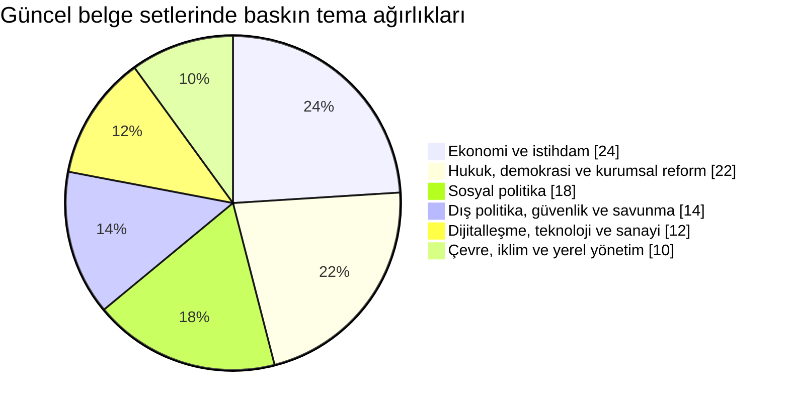
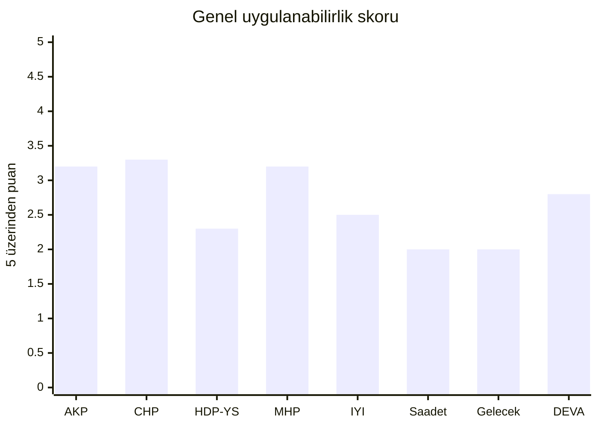
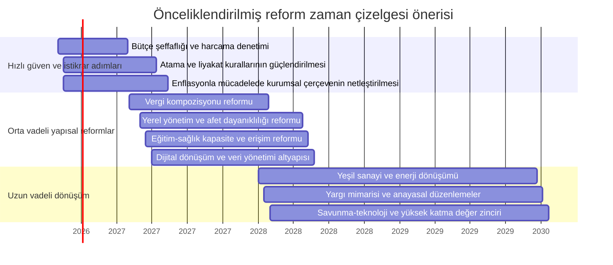

# Türkiye'deki Siyasi Parti Programları ve Güncel Beyannameleri

## Yönetici özeti

Bu raporun en önemli bulgusu şudur: **20 Temmuz 2026 itibarıyla Türkiye’de 2026 yılına özgü yeni bir genel seçim beyannamesi dalgası yoktur.** Bunun temel nedeni, TBMM ve Cumhurbaşkanlığı seçimlerinin Anayasa gereği beş yılda bir aynı gün yapılması ve 2023 seçimlerinden sonra olağan takvimin 2028’e işaret etmesidir. Bu yüzden rapor, partilerin **2026 itibarıyla erişilebilir en güncel resmi metinlerini** bir araya getirir: yürürlükteki parti programları, 2023 genel seçim beyannameleri/bildirgeleri, 2024 yerel seçim bildirgeleri ve bazı partiler için 2023 muhalefet ortak metinleri. citeturn29view2turn29view1turn21search7turn24view0turn27search1

Karşılaştırmalı olarak bakıldığında, büyük ayrım çizgisi yalnızca “sağ-sol” değildir. Asıl farklar; **yönetim sistemi**, **para ve kurumu kim yönetecek**, **yerel yönetimlere ne kadar alan açılacak**, **iklim ve teknoloji dönüşümünün nasıl finanse edileceği** ve **güvenlik-sivil özgürlük dengesi** üzerinde toplanır. AKP ve MHP mevcut başkanlık düzeninin devamı içinde yüksek teknoloji, savunma, altyapı ve kontrollü sosyal destek kombinasyonuna yaslanırken; CHP, DEVA, Gelecek, Saadet ve İYİ Parti çizgisi daha çok güçlendirilmiş parlamenter sistem, liyakat, vergi adaleti ve kurumsal onarım üzerinden politika üretir. HDP’nin programatik çizgisi ise Yeşil Sol belgeleriyle birlikte okunduğunda diğerlerinden daha belirgin biçimde **demokratikleşme, yerelleşme, ekoloji ve toplumsal çoğulculuk** ekseninde ayrışır. citeturn21search7turn33view1turn24view2turn35view0turn48view3turn48view4

Ekonomi alanında hemen bütün partiler büyüme, üretim, teknoloji ve istihdamdan söz ediyor; ayrışma daha çok **enflasyonla mücadelede kurumsal araçlar**, **vergide dolaylı-doğrudan denge**, **kamu yatırımının rolü**, **dış finansmana bağımlılık** ve **sosyal transferlerin kapsamı** üzerinde ortaya çıkıyor. 2026 bütçesi toplam ödenek bakımından yaklaşık 18,8 trilyon TL, genel bütçe geliri yaklaşık 16,1 trilyon TL düzeyinde; merkezi yönetim harcamalarının GSYH’ye oranı yüzde 23,8, gelirlerin oranı yüzde 20,0 ve vergi gelirlerinin oranı yüzde 17,3 olarak öngörülüyor. Haziran 2026’da yıllık TÜFE yüzde 32,11, Mayıs 2026’da işsizlik oranı yüzde 8,4; TCMB’nin Mayıs 2026 Enflasyon Raporu da yıl sonu tahminini yüzde 26 olarak veriyor. Bu tablo, hemen tüm partiler için mali alanın sınırlı, kurumsal güvenilirliğin ise kritik olduğunu gösteriyor. citeturn49view2turn14search0turn10search0turn9search3turn31search1

Metodolojik olarak bu rapor, parti programlarını “kimlik metni”, seçim beyannamelerini ise “uygulama ve öncelik metni” olarak okur. Bu yaklaşım, Türkiye’de parti programlarının temel sosyal sorunlara yaklaşımı ve 2023 seçim beyannamelerinin artan siyasal salience’ı üzerine yapılan akademik çalışmalarla da uyumludur. citeturn28search0turn28search1turn28search8

## Kapsam ve yöntem

Bu çalışma, kullanıcı tarafından zorunlu tutulan çekirdek listeye odaklanır: **AKP, CHP, HDP, MHP, İYİ Parti, Saadet Partisi, Gelecek Partisi ve DEVA Partisi**. HDP başlığı, 2023 genel seçiminde oyların Yeşil Sol Parti listesine yönlendirilmiş olması ve 2026’da bu ideolojik hattın programatik olarak HDP/Yeşil Sol metinleri üzerinden daha tutarlı okunabilmesi nedeniyle **HDP–Yeşil Sol çizgisi** olarak ele alınmıştır. Buna karşılık DEM Parti, TİP, Yeniden Refah, BBP gibi diğer erişilebilir partiler bu sürüme kapsam tercihi nedeniyle dahil edilmemiştir. citeturn2search8turn11view7turn11view8turn11view9

Kaynak önceliği şu sırayla kurulmuştur: **resmi parti siteleri ve resmi doküman arşivleri**, **resmi mevzuat ve bütçe belgeleri**, **resmi istatistikler**, ardından **orijinal akademik makaleler** ve yalnızca boşlukları kapatmak için **güvenilir haber ajansları**. 2026’ya özgü yeni genel seçim beyannamesi bulunmadığından, her parti için en yeni erişilebilir resmi belge seti kullanılmıştır; bazı partilerde bu set bağımsız bir genel seçim metni değil, **parti programı + 2023 ortak muhalefet metni + 2024 yerel bildiri** kombinasyonudur. citeturn21search7turn24view2turn32search5turn16view3turn11view5turn34search1

Aşağıdaki tablo, her parti için hangi belge setinin esas alındığını gösterir:

| Parti | Esas alınan güncel resmi metin seti | Belge güncelliği notu | Başlıca kaynaklar |
|---|---|---|---|
| AKP | Parti Programı + 2023 Seçim Beyannamesi | 2026’ya özgü yeni genel beyanname yok; 2023 metni son ulusal ana metin | citeturn3search1turn21search7turn21search9turn38view0 |
| CHP | CHP Programı + 2023 Ortak Politikalar Mutabakat Metni + 2024 Yerel Seçim Bildirgesi | 2023 ulusal çerçeve ortak metin üzerinden; 2024 yerel bildiri son seçim belgesi | citeturn39search0turn24view2turn24view0turn39search1 |
| HDP | HDP Parti Programı + 2023 Yeşil Sol Seçim Bildirgesi + Yeşil Sol Programı | 2023 seçim hattı Yeşil Sol üzerinden okunmalı | citeturn11view7turn11view8turn11view9turn2search8 |
| MHP | 2024 Parti Programı + 2023 Seçim Beyannamesi | Parti programı 2024’te güncellenmiş | citeturn27search6turn33view1turn27search1turn27search2 |
| İYİ Parti | İYİ Parti Programı + 2026 parti/tüzük ve TBMM metinleri | 2026 itibarıyla erişilebilir temel resmi metin daha çok program odaklı | citeturn35view0turn34search5turn34search8 |
| Saadet | Parti Programı + 2023 Ortak Politikalar Mutabakat Metni | Ayrı 2026 genel beyanname yerine program + ortak metin daha belirgin | citeturn11view5turn24view2 |
| Gelecek | Parti Programı + 2023 Ortak Politikalar Mutabakat Metni | Ayrı 2026 genel beyanname yerine program + ortak metin daha belirgin | citeturn11view4turn24view2 |
| DEVA | Parti Programı + eylem planları + 2023 Ortak Politikalar Mutabakat Metni | Program metni ve eylem planları yüksek ayrıntı sağlıyor | citeturn33view3turn33view2turn32search6turn32search8turn24view2 |

## Politika eksenleri ve temel ayrımlar

Türk parti rekabetinde en güçlü kurumsal ayrım, **Cumhurbaşkanlığı Hükûmet Sistemi’nin sürdürülmesi** ile **parlamenter sisteme dönüş** arasında kuruluyor. AKP 2023 beyannamesinde “yeni anayasa”yı mevcut iktidar hattı içinde yeniden çerçevelerken, MHP 2024 programı Cumhurbaşkanlığı Hükûmet Sistemi’ni Türkiye’nin geleceği için kritik görüyor. Buna karşılık CHP, DEVA, Gelecek, Saadet ve İYİ Parti metinleri kuvvetler ayrılığı, tarafsız yargı ve güçlendirilmiş parlamenter sistem etrafında birleşiyor. HDP/Yeşil Sol hattı da yürütmenin yargı üzerindeki tahakkümünü kaldırma ve yerelleşme talepleriyle bu ikinci kümeye yakın duruyor; fakat bunu çok daha güçlü bir ademimerkeziyetçi ve çoğulcu demokratikleşme diliyle yapıyor. citeturn38view0turn33view1turn24view2turn35view0turn43view4turn42view2turn48view3

Ekonomi cephesinde neredeyse bütün partiler **üretim, istihdam, ihracat, teknoloji ve katma değer** vurgusu yapıyor. Dolayısıyla fark, “sanayi olsun mu olmasın mı” sorusunda değil; **kurumsal bağımsızlık**, **vergide adalet**, **piyasa-devlet dengesi**, **kamu-özel işbirliği biçimi**, **sosyal transferlerin ölçeği** ve **enflasyonla mücadele aracının ne olduğu** sorularında ortaya çıkıyor. AKP ve MHP metinleri daha çok devlet yönlendirmeli üretim, savunma-teknoloji, mali disiplin ve seçici refah alanlarına yaslanırken; CHP, DEVA, Gelecek, Saadet ve İYİ Parti tarafında kurumsal güven, öngörülebilirlik, liyakat ve vergi kompozisyonu reformu daha öne çıkıyor. HDP/Yeşil Sol ise buna ek olarak redistribütif ve ekososyal bir çizgi öneriyor. citeturn21search7turn45view1turn45view0turn39search0turn41view2turn42view0turn36view0turn48view1turn48view4

Çevre, iklim ve yerelleşme alanlarında fark daha belirgindir. AKP çevreyi çoğunlukla şehircilik, kentsel dönüşüm ve bölgesel kalkınma ile birlikte; MHP sürdürülebilir kalkınma ve “çevrecilik milliyetçiliktir” çerçevesiyle; DEVA ve Gelecek piyasa uyumlu yeşil dönüşüm ve teknoloji yatırımıyla; CHP yeşil, mor ve dijital ekonomi anlayışıyla; HDP/Yeşil Sol ise çevre ve iklim adaletini sistemin merkezine koyarak ele alıyor. Yerel yönetimlerde CHP, İYİ Parti, Saadet, Gelecek, DEVA ve HDP/Yeşil Sol açık biçimde daha güçlü yerelleşme ve katılım talep ederken, AKP ve MHP’de yerel kapasite artırımı öne çıksa da genel çerçeve daha merkeziyetçi kalıyor. citeturn21search7turn44view2turn41view0turn42view1turn39search0turn39search1turn37view0turn43view5turn48view4turn48view5turn47view0

Aşağıdaki tablo, ana politika alanlarında partilerin konumunu sıkıştırılmış biçimde gösterir:

| Politika alanı | AKP | CHP | HDP–Yeşil Sol | MHP | İYİ Parti | Saadet | Gelecek | DEVA |
|---|---|---|---|---|---|---|---|---|
| Yönetim sistemi | Başkanlık sistemi içinde yeni anayasa | Güçlendirilmiş parlamenter sistem | Demokratikleşme + güçlü yerelleşme | Başkanlık sistemini tahkim | Güçlendirilmiş parlamenter sistem | Parlamenter/uzlaşıcı anayasa | Kuvvetler ayrılığı + parlamenter çerçeve | Güçlü parlamenter sistem |
| Ekonomi | Kamu yönlendirmeli büyüme, dijitalleşme, savunma ve milli teknoloji | Planlı kalkınma, vergi adaleti, yeşil-mor-dijital ekonomi | Yeniden dağıtım, emek ve ekoloji | Millî üretim, fiyat istikrarı, vergi adaleti | Düşük enflasyon, TCMB bağımsızlığı, dış açık azaltımı | Üretim ekonomisi, adil paylaşım | Kapsayıcı ve çevre dostu büyüme | Kurumsal güven, para politikası bağımsızlığı, Fintek |
| Sosyal politika | Aile merkezli, seçici destek genişlemesi | Hak temelli sosyal devlet | Toplumsal eşitlik, kadın ve çocuk hakları | Aile–emekli–engelli odaklı | Eğitim, aile hekimliği, sosyal destek | İnsan onuru ve sosyal adalet | Aile, yoksulluk, sosyal güvenlik | Kapsayıcı sosyal koruma |
| Dış politika | Stratejik özerklik, savunma ve göç yönetimi | AB tam üyelik, kurumsal dış politika | Barış, demokratikleşme, halkların eşitliği | Güvenlik merkezli, AB’ye koşullu yaklaşım | Millî çıkar esaslı gerçekçilik | “Şahsiyetli” dış politika | AB stratejik hedef, çok boyutlu diplomasi | Kural temelli, NATO/AB ile dengeli ilişki |
| Hukuk-yargı | Yeni anayasa ama sistem sürekliliği | Yargı bağımsızlığı ve AİHM/AİHS standartları | Yürütme tahakkümünü sonlandırma | Bağımsız yargı, ama rejim sürekliliği | Bağımsız yargı + siyasi etik | Yeni anayasa + yargı reformu | HSK reformu, yargı bağımsızlığı | Yargı bağımsızlığı, şeffaf kurumlar |
| Çevre-iklim | Şehircilik ve bölgesel kalkınma ile entegre | İklim dayanıklılığı ve adil dönüşüm | İklim adaleti, fosilden çıkış, yerel iklim yönetimi | Sürdürülebilir kalkınma, çevrecilik milliyetçiliktir | Teknoloji ve altyapı odaklı çevresel modernizasyon | Koruma planları ve çevreci madencilik | Doğa dostu büyüme | Çevre dostu teknoloji ve temiz enerji |
| Yerel yönetimler | Kapasite artışı, merkezi koordinasyon baskın | Katılımcı ve güçlü belediyecilik | Yerelleşme ve özerklik şartı | Hizmet kapasitesi artışı | Çerçeve kanun, katılımcı mahalli idare | Görev devri ve yerel güçlenme | Yetki devri ve demokratik yerellik | Yerel kalkınma ve veri-temelli koordinasyon |
| Dijital-teknoloji | Milli Teknoloji Hamlesi, e-devlet, siber güvenlik | Dijital dönüşüm, sosyal inovasyon | Ekolojik-toplumsal öncelikli teknoloji | Bilgi-teknoloji ekosistemi, yapay zekâ ve siber güvenlik | Girişimcilik, akıllı şehirler, siber güvenlik | Yapay zekâ ve tekno-girişim desteği | Kuantum/AI/Nesnelerin interneti ile dönüşüm | Açık veri, yapay zekâ, Fintek, dijital rekabet |

Bu tablodaki sınıflandırma, aşağıda ayrıntılandırılan resmi parti metinlerinin karşılaştırmalı okumasına dayalıdır. Özellikle CHP–DEVA–Gelecek–Saadet–İYİ ortak kümesinde 2023 Ortak Politikalar Mutabakat Metni, kurumlar, ekonomi, dijital dönüşüm, eğitim ve dış politika konusunda belirleyici omurga işlevi görürken; AKP ve MHP’de parti içi resmi belge sürekliliği daha güçlüdür. HDP–Yeşil Sol hattında ise programatik fark yaratan öğeler ekoloji, kadın özgürlüğü, yerelleşme ve yargıdaki demokratikleşme talepleridir. citeturn24view2turn21search7turn33view1turn35view0turn48view4turn48view5

Aşağıdaki görsel, bu rapordaki belge setlerinin **niteliksel kodlamasına** göre baskın tema dağılımını gösterir. Bu grafik resmî belgelerin sayısal bir içerik analizi değil, raporun analitik sentezidir; kodlama resmi belge kümeleri ve karşılaştırmalı siyasal program analizi literatürü temel alınarak yapılmıştır. citeturn21search7turn24view2turn33view1turn35view0turn48view4turn28search0turn28search1

## Parti bazında ayrıntılı analiz

### AKP

AKP’nin resmî belge seti, 2000’lerin başındaki “kalkınma ve demokratikleşme” partisi kimliğini koruyan parti programı ile 2023 tarihli **“Türkiye Yüzyılı İçin Doğru Adımlar”** seçim beyannamesi etrafında kuruludur. 2023 beyannamesi 481 sayfa ve altı ana bölümden oluşur; afet yönetimi, istikrarlı ekonomi, dijitalleşme, yüksek teknoloji, savunma sanayii, yeni anayasa ve göç yönetimi ana dosyalar olarak öne çıkar. Belgenin ideolojik dili, muhafazakâr-demokrat çizgiyi güçlü devlet, aile, milli teknoloji ve stratejik özerklik söylemiyle birleştirir. citeturn3search1turn21search7turn21search9turn38view0turn38view1

Ekonomide AKP, büyümeyi kurumsal restorasyondan çok **yatırım, üretim, ihracat, enerji bağımsızlığı ve teknoloji ölçeklenmesi** üzerinden okuyor. Beyanname “enflasyonla mücadele”, “kamu maliyesi ve mali disiplin”, “dijitalleşme ve dijital dönüşüm”, “yüksek teknolojilerde öncü Türkiye” ve “milli savunma sanayii” başlıklarını ayrı dosyalar halinde kuruyor; bu da partinin ekonomi politikasını klasik makro istikrar çizgisinden ziyade **yatırım-devlet-sanayi-teknoloji zinciri** olarak tasarladığını gösteriyor. Sosyal politikalarda aile kurumunun korunması, kadın ve genç istihdamının artırılması, göç yönetiminin merkezi koordinasyonla sürdürülmesi ve hizmetlere dijital erişimin genişletilmesi öne çıkıyor. Hukuk ve yargı alanında “yeni anayasa” vurgusu bulunuyor; ancak bu, muhalefetin önerdiği türden bir rejim değişikliği değil, sistem içi yeniden yazım perspektifiyle sunuluyor. Dış politikada ve güvenlikte savunma sanayii, terörle mücadele ve stratejik göç yönetimi birincil önemde. Çevre ve iklim dosyası ise esasen şehircilik, kentsel dönüşüm ve bölgesel kalkınma ile birlikte ele alınıyor. citeturn21search7turn21search9turn38view0turn38view1

Seçim vaatlerinin uygulanabilirliği bakımından AKP’nin en büyük avantajı, kısa vadede yürütme kapasitesi ve devlet mekanizmasıyla kurduğu fiili uyumdur; bu nedenle **kısa vade puanı görece yüksektir**. Buna karşılık orta ve uzun vadede aynı vaat paketinin önünde yüksek enflasyon, sınırlı bütçe alanı, kurumsal güven sorunu ve büyümeyi sürdürürken fiyat istikrarını kalıcılaştırma güçlüğü vardır. 2026 bütçesinin büyüklüğü ve açık yapısı ile Haziran 2026 enflasyon düzeyi dikkate alındığında, AKP’nin teknoloji-savunma-yatırım önceliklerini finanse etmesi görece mümkün; fakat bunu geniş sosyal refah artışıyla birleştirmesi daha zor görünmektedir. **Kısa vade: yüksek; orta vade: orta; uzun vade: orta-altı.** citeturn49view2turn14search0turn10search0turn31search1turn21search7

**Başlıca resmi metinler:** AK Parti Parti Programı; AK Parti 2023 Seçim Beyannamesi; İletişim Başkanlığı ve AA seçim özeti. citeturn3search1turn21search7turn21search9turn38view0turn38view1

### CHP

CHP’nin mevcut belgeleri, klasik seçim beyannamesinden daha fazla **programatik dönüşüm ve ortak muhalefet çerçevesi** üzerinden okunmalıdır. Resmî CHP programı, partiyi sosyal demokrasi, yurttaşlık, toplumsal adalet, dijital devrim, iklim krizi ve aktif devlet kapasitesi bağlamında yeniden tanımlar. 2023 genel seçim düzeyinde ise altı partinin **Ortak Politikalar Mutabakat Metni**, CHP’nin ulusal hükümet perspektifinin ana omurgası işlevini görmüştür; 2024 yerel seçim bildirgesi ise şeffaf, katılımcı ve sosyal belediyecilikte güncel çizgiyi verir. citeturn39search0turn24view2turn24view0turn39search1turn39search5

Ekonomide CHP, **dolaylı vergiden doğrudan vergiye kayış**, planlı kalkınma, yeşil-mor-dijital dönüşüm ve güçlü sosyal devlet vurgusuyla ayrışır. Hukuk ve yargıda bağımsızlık, AİHS/AİHM standartları, güçlü denge-denetleme ve parlamenter restorasyon merkezîdir. Sosyal politikalarda kamusal eğitim ve sağlık, yoksullukla mücadele, kadın ve gençlerin güçlendirilmesi, bakım ekonomisi ve yerel erişim ağları öne çıkar. Dış politikada AB tam üyelik hedefi korunur; güvenlik daha çok vatandaş güvenliği, demokratik denetim ve kurumsal kapasiteyle birlikte düşünülür. Yerel yönetimlerde CHP 2024 metinleri son derece nettir: daha şeffaf, katılımcı, dijital ve mali kapasitesi yüksek belediyeler; kreşler, sosyal destek ağları, kentsel dayanıklılık ve dijital katılım platformları belirgin başlıklardır. citeturn39search0turn24view2turn39search1turn39search5

Uygulanabilirlik açısından CHP’nin temel gücü, belge tutarlılığı ve **kurumsal reform mantığının iç bütünlüğü**dür. Temel zayıflığı ise, bu paketlerin çoğunun kısa vadede ancak yürütme gücü değişirse uygulanabilir olmasıdır. 2026 mali ve enflasyonist zeminde CHP çizgisindeki yüksek sosyal devlet + vergi adaleti + kurumsal restorasyon paketi teknik olarak mümkün olsa da bunun ön koşulu siyasî iktidar değişimi ve geçiş maliyetlerinin yönetilmesidir. Buna rağmen orta ve uzun vadede kurumsal güveni yeniden üretme kapasitesi nedeniyle CHP’nin programı, belgelerin iç tutarlılığı bakımından en güçlü çerçevelerden biridir. **Kısa vade: orta-altı; orta vade: orta-yüksek; uzun vade: yüksek.** citeturn24view2turn39search0turn39search1turn10search0turn49view2turn31search1

**Başlıca resmi metinler:** CHP Programı; 2023 Ortak Politikalar Mutabakat Metni; 2024 Yerel Seçim Bildirgesi; parti programı tanıtım ve bölüm metinleri. citeturn39search0turn24view2turn24view0turn39search1turn39search5turn39search6

### HDP

Kullanıcının talebine uygun olarak bu başlık **HDP–Yeşil Sol hattı** şeklinde kurulmuştur. Bunun nedeni, HDP’nin 2023 seçiminde oyların Yeşil Sol Parti’ye verilmesini açık biçimde yönlendirmiş olması ve seçim bildirgesinin de Yeşil Sol üzerinden yayımlanmasıdır. HDP parti programı çoğulculuk, halkların eşitliği, kadın özgürlüğü, barış ve yerel demokrasi ekseninde bir ideolojik çerçeve sunarken; Yeşil Sol 2023 bildirgesi bunu somut vaatlere dönüştürür. citeturn2search8turn11view7turn11view8turn11view9

Bu çizginin temel ideolojisi, diğer ana partilerden daha belirgin biçimde **feminist, ekolojist, çoğulcu ve ademimerkeziyetçi** bir hattır. Hukuk ve yargıda yürütmenin yargı tahakkümünü kaldırma, YSK kararlarına karşı yargı yolunu açma, gizli tanık temelli hukuksuz yargılamaları sonlandırma ve Anayasa Mahkemesi üyeliklerinde yürütme gücünü sınırlama önerileri dikkat çekicidir. Sosyal politikada kadın, çocuk, emekli ve emek hakları güçlü biçimde öne çıkar; örneğin en düşük emekli aylığını asgari ücret düzeyine yükseltme ve İstanbul Sözleşmesi’ni geri getirme vaatleri bu çizginin yeniden dağıtım ile toplumsal özgürlükleri birlikte ele aldığını gösterir. Çevre ve iklim alanında Yeşil Sol programı, iklim adaletini siyasetin merkezine koyar; fosil yakıtları terk etmeyi, kirli teknolojilerden çıkmayı, Kanal İstanbul’u iptal etmeyi ve yerel yönetimleri iklim uyumunun ana kurumu saymayı savunur. Yerel yönetimler ve Kürt meselesi açısından da yetkinin yerele azami devrini ve Avrupa Konseyi Yerel Yönetimler Özerklik Şartı üzerindeki çekincelerin kaldırılmasını ister. citeturn48view1turn48view2turn48view3turn48view4turn48view5turn48view0

Uygulanabilirlik açısından HDP–Yeşil Sol hattının belgeleri en dönüştürücü metinler arasında olsa da kısa vadede en zor paketlerden biridir. Bunun sebebi maliyet değil yalnızca; önerilerin önemli bir bölümü **anayasal-siyasal rejim değişikliği, güvenlik doktrini değişimi ve güçlü yerelleşme** gerektirir. Kısa vadede baskın merkeziyetçi yapı nedeniyle uygulanabilirlik düşüktür; orta ve uzun vadede ise demokratik normalleşme senaryolarında bu programın bazı başlıkları —özellikle sosyal haklar, yerel iklim yönetimi ve yargı reformu— daha gerçekçi hale gelir. **Kısa vade: düşük; orta vade: orta-altı; uzun vade: orta.** citeturn48view3turn48view4turn48view5turn29view2turn10search0

**Başlıca resmi metinler:** HDP Parti Programı; Yeşil Sol 2023 Seçim Bildirgesi; Yeşil Sol Parti Programı; HDP’nin 2023 seçim yönlendirmesi. citeturn11view7turn11view8turn11view9turn2search8

### MHP

MHP’nin belgesel mimarisi oldukça nettir: 2023 seçim beyannamesi ile 2024’te yenilenmiş parti programı arasında süreklilik vardır. 2024 programı kendisini **“Millî Yükseliş İradesi”** olarak tanımlar ve Türkiye’yi “Lider Ülke ve Süper Güç” yapma hedefini açık biçimde ortaya koyar. İdeolojik omurga; milliyetçi-devletçi çizgi, güçlü devlet, milli birlik, ekonomik güvenlik ve sistem istikrarı etrafında kurulur. citeturn27search6turn33view1turn27search1turn27search2turn38view2

Ekonomide MHP, piyasa ekonomisini bütünüyle reddetmez; fakat onu **milli güvenlik ve yerli üretim** perspektifiyle sınırlandırır. Program, fiyat istikrarını, cari açık ve borç kırılganlığını azaltan para-kur politikasını, adaletli vergi sistemini, dolaylı vergilerin payını düşürmeyi, istihdam teşviklerini ve verimlilik-temelli üretimi savunur. Sosyal politikada emekli aylıklarını genel enflasyon değil yaşlı tüketim kalıbına özgü endekse bağlama, aile, engelli ve şehit-gazi yakınlarına yönelik koruma mekanizmaları öne çıkar. Hukuk ve yargıda bağımsız ve tarafsız yargı, adil yargılanma, hak arama özgürlüğü ve yargı süreçlerinde verimlilik vurgusu vardır; ancak bu çizgi başkanlık sistemini sorgulamaz. Dış politikada AB üyeliği bir kimlik-kader mecburiyeti olarak görülmez; üyelik müzakereleri bazı milli şartların sağlanmasına bağlanır. Teknoloji ve savunma alanında yapay zekâ, büyük veri, siber güvenlik, teknokentler ve yerli savunma sanayii dikkat çeker. Yerel yönetimler ise daha çok hizmet kapasitesinin yükseltilmesi ve kamu hizmetlerinin yerel düzeyde etkin sunumu bağlamında ele alınır; belirgin bir yerelleşme reformu önerilmez. citeturn45view1turn45view0turn45view2turn44view1turn44view2turn44view3turn44view4turn47view0

MHP’nin uygulanabilirlik gücü, özellikle kısa vadede, Cumhur İttifakı içindeki siyasî etkisinden gelir. Bu nedenle vergi adaleti, emekli-endeksleme, istihdam teşvikleri ve savunma-teknoloji öncelikleri gibi başlıklar kısa vadede görece uygulanabilir görünür. Buna karşılık MHP’nin daha iddialı ekonomik hedefleri —yüksek büyüme, yüksek teknoloji, refah artışı ve düşük enflasyonu eşzamanlı gerçekleştirme gibi— 2026 makro zeminde ciddi kaynak ve koordinasyon sorunu doğurur. **Kısa vade: yüksek; orta vade: orta; uzun vade: orta-altı.** citeturn33view1turn45view1turn49view2turn10search0turn31search1

**Başlıca resmi metinler:** MHP 2024 Parti Programı; 2023 Seçim Beyannamesi; AA kısa özet. citeturn27search6turn33view1turn27search1turn27search2turn38view2

### İYİ Parti

İYİ Parti’nin 2026 itibarıyla erişilebilir en güçlü resmi metni, Ankara İl Başkanlığı’nın yayımladığı ve merkezi parti hatlarıyla uyumlu görünen ayrıntılı **İYİ Parti Programı**dır. Bu metin, iyi bir Türkiye, kuvvetler ayrılığı, çoğulcu demokrasi, hesap verebilirlik, siyasi etik, güçlü parlamenter sistem ve hukukun üstünlüğü çerçevesinde kurulur. 2026 resmî site ve TBMM içerikleri de partinin güncel çizgisinin parlamenter denetim, bütçe eleştirisi, eğitim, sağlık ve yargı sorunları etrafında devam ettiğini gösterir. citeturn35view0turn34search5turn34search8turn34search2

Ekonomi alanında İYİ Parti metni son derece açıktır: yüksek büyümenin bedelinin yüksek enflasyon, yüksek dış açık ve yüksek kamu açığı olmaması gerektiğini vurgular; enflasyonun kalıcı biçimde düşürülmesi, fiyat istikrarı, TCMB’nin araç bağımsızlığı, dış ticaret açığının azaltılması ve yatırım ihtiyacını karşılayacak güvenilir ortam kurulması hedeflenir. Vergi alanında program doğrudan kapsamlı teknik ayrıntı vermekten çok yatırım, girişimcilik ve yeni teknoloji girişimlerine teşvik mantığını öne çıkarır. Sosyal politikalarda okul öncesi eğitim, fırsat eşitliği, burs ve yurt politikaları, güçlendirilmiş aile hekimliği, sevk zinciri, düşük gelirli grupların sağlık katkı paylarının azaltılması gibi somut vaatler vardır. Yerel yönetimlerde “Mahalli İdareler Çerçeve Kanunu” önerisi, temsil ve kamuoyu denetimi mekanizmalarıyla birlikte dikkat çekicidir. Dış politikada milli güç unsurlarının gerçekçi analizi ve milli çıkar merkezli çizgi öne çıkar. Teknoloji ve girişimcilikte yapay zekâ, akıllı şehirler, siber güvenlik, teknoloji transferi, kadınların STEM ve girişimcilikte desteklenmesi gibi ayrıntılı vaatler bulunur. citeturn36view0turn36view1turn36view3turn37view0turn37view2turn37view3

İYİ Parti’nin ana zorluğu, belge ayrıntısının yüksek olmasına rağmen 2026 itibarıyla bu paketi tek başına uygulayacak iktidar kapasitesine sahip olmamasıdır. Programın önemli kısmı teknik olarak uygulanabilir ve maliyetlendirmeye elverişli görünse de, kısa vadede siyasî kaldıraç eksikliği belirleyicidir. Bununla birlikte İYİ Parti metinleri, özellikle makroekonomide kurumsal güven ve yerel yönetim reformu bakımından uygulanabilir politika tasarımına sahip belgeler arasındadır. **Kısa vade: orta-altı; orta vade: orta; uzun vade: orta.** citeturn35view0turn36view0turn37view0turn49view2turn10search0turn31search1

**Başlıca resmi metinler:** İYİ Parti Programı; İYİ Parti Tüzüğü; 2026 TBMM gündemi ve bütçe açıklamaları. citeturn35view0turn34search5turn34search8turn34search2

### Saadet Partisi

Saadet Partisi programı, ideolojik olarak **Milli Görüş geleneğini** çağdaşlaştırılmış bir siyasal program halinde sunuyor. Metin; adil yönetim, adil hukuk düzeni, üretime dayalı ekonomi, milli ordu, bilgi ve teknolojiyi üreten ilmî yapı ve “şahsiyetli dış politika” kavramlarını bir araya getiriyor. Program, mevcut sisteme yönelik eleştirisini Meclis denetiminin ve yargının zayıflaması üzerinden kuruyor; yeni anayasa, yargı bağımsızlığı ve seçim barajının kaldırılması gibi açık öneriler içeriyor. citeturn43view0turn43view4turn43view5turn28search2

Ekonomide Saadet’in ana mantığı, üretim ekonomisi ve adil paylaşım çizgisidir. Ayrıntı düzeyi DEVA kadar yüksek değildir; ancak teknoloji ve inovasyon başlığında yüksek katma değerli sektörler, biyoteknoloji, nanoteknoloji, yapay zekâ, robotik ve girişimcilik destekleri açık biçimde sayılır. Sosyal politikalarda insan onuruna yaraşır yaşam, sosyal güvenlik, aile ve eğitim merkezîdir. Çevre politikası koruma planları, eğitim ve toplumsal bilinç, çevreci madencilik ve uluslararası çevre rejimlerinde belirleyici rol alma hedefiyle kurulur. Yerel yönetimlerde “yerel ve yerinde yönetimlerin güçlendirilmesi” ve merkezî idarenin savunma, adalet, iç güvenlik, vergi ve hizmet koordinasyonu dışındaki bazı görevlerinin yerlere devri önerilir; bu, Saadet’in beklenenden daha belirgin bir yerelleşme damarı taşıdığını gösterir. Dış politikada Batı karşıtlığından çok daha çok “şahsiyetli”, bağımsız ve inisiyatif alan Türkiye vurgusu öne çıkar. citeturn43view1turn43view2turn43view3turn43view4turn43view5

Uygulanabilirlik açısından Saadet’in metinleri normatif olarak tutarlı, fakat idari ayrıntı ve maliyetlendirme açısından orta yoğunluktadır. Kısa vadede seçmen-sistem dengesi ve düşük yürütme kapasitesi nedeniyle uygulanabilirlik sınırlıdır; orta vadede koalisyon/ittifak etkisiyle bazı anayasal ve sosyal başlıklar gündeme gelebilir. Uzun vadede ise programın en güçlü yanı, üretim ekonomisi ile ahlak-siyaset söylemini birleştirmesidir; en zayıf yanı ise bunu somut bütçe ve kurumsal araçlara her başlıkta aynı netlikle dönüştürememesidir. **Kısa vade: düşük; orta vade: düşük-orta; uzun vade: orta.** citeturn11view5turn43view3turn43view4turn49view2

**Başlıca resmi metinler:** Saadet Partisi Programı; 2023 Ortak Politikalar Mutabakat Metni. citeturn11view5turn24view2

### Gelecek Partisi

Gelecek Partisi programı, Türkiye siyasetinde muhafazakâr-demokrat zemini **kurumsal restorasyon, çevresel sorumluluk ve AB çıpası** ile yeniden sentezleme çabası olarak okunabilir. Program, hukukun üstünlüğünü ekonomik başarının ön şartı sayar; yargı bağımsızlığı, kuvvetler ayrılığı, HSK reformu ve etkin adalet yapısı üzerinde ayrıntılı durur. Dış politikada AB’yi stratejik hedef olarak korur; aynı zamanda çok boyutlu dış politika ve bölgesel kurumsal kapasite önerir. citeturn42view0turn42view2turn42view3

Ekonomide Gelecek Partisi sürdürülebilir, kapsayıcı ve çevre dostu büyüme; bilgi tabanlı dijital dönüşüm; yapay zekâ, kuantum bilişim ve nesnelerin interneti ile orta gelir tuzağının aşılması fikrini savunur. Bu yönüyle teknoloji dosyası diğer muhafazakâr kökenli partiler arasında en açık yazılmış metinlerden biridir. Çevre ve iklim alanında da “iklim ve çevre ekolojik sorumluluk” başlığı çevreyi yalnızca sektörel değil, tüm yatırım ve politika setinin temeli olarak ele alır. Sosyal politikalar ailenin ekonomik ve sosyal boyutları, yoksullukla mücadele ve sosyal güvenlik çerçevesinde formüle edilir. Yerel yönetimlerde ise vesayetin azaltılması, sadeleşme ve işlevsel demokratik yerellik vurgusu bulunur. citeturn42view0turn42view1turn42view2turn42view3

Uygulanabilirlik bakımından Gelecek Partisi belgeleri yüksek kuramsal tutarlılığa sahiptir; ancak siyasal taşıyıcı kapasite sınırlıdır. Program özellikle hukuk, AB ve dijital dönüşüm alanlarında teknik bir akıl sunar; buna rağmen ekonomik iddialarının önemli kısmı güçlü bir iktidar koordinasyonu ve dış kaynak güveni gerektirir. **Kısa vade: düşük; orta vade: düşük-orta; uzun vade: orta.** citeturn42view0turn42view2turn42view3turn31search1turn14search0

**Başlıca resmi metinler:** Gelecek Partisi Programı; 2023 Ortak Politikalar Mutabakat Metni. citeturn11view4turn24view2

### DEVA

DEVA Partisi’nin programı, bu rapordaki en sistematik ve teknik metinlerden biridir. Resmî program, demokrasi, adalet, kamu yönetimi, ekonomi, sektörel politikalar, sosyal politikalar, çevre, güvenlik-savunma ve dış politika başlıklarını son derece düzenli bir yapıda işler. Buna ek olarak partinin güçlendirilmiş parlamenter sistem ve dış politika-güvenlik eylem planları, programı uygulama araçları bakımından zenginleştirir. İdeolojik olarak metin; liberal-demokrat, piyasa dostu fakat kurumsal ve sosyal devlet boyutlarını dışlamayan bir çizgi izler. citeturn33view2turn33view3turn32search6turn32search8

Ekonomide DEVA, TCMB’nin araç bağımsızlığını, şeffaflık ve hesap verebilirliği, sade ve adil vergi yapısını, Fintek ve alternatif finansmanı, yerel istihdam programlarını, işgücü piyasası reformunu ve veri-temelli dijital dönüşümü öne çıkarır. Teknoloji ve dijital dönüşüm başlığı, açık veri platformu, yerli dijital çözüm firmaları, dijital etik, yapay zekâ ve girişimcilik ekonomisi hedefleriyle özellikle ayrıntılıdır. Sosyal politikalarda eğitim, sağlık, sosyal yardım ve dezavantajlı gruplar başlıkları ayrı ayrı işlenir. Hukuk ve yargıda kuvvetler ayrılığı, tarafsız yargı ve etkili kamu yönetimi beni merkezde bulur. Dış politikada NATO müttefikleri, AB ortakları ve bölgesel aktörlerle dengeli, yapıcı ve ilkesel bir çizgi savunulur; savunma sanayiinde dışa bağımlılığı azaltma hedefi korunur. Yerel yönetimler açısından merkezi ve yerel düzey arasında koordinasyon arayan, ama veri ve kurumsal kapasiteyi genişleten daha teknokratik bir yaklaşım vardır. citeturn41view0turn41view1turn41view2turn41view3turn32search6turn32search8

Uygulanabilirlik bakımından DEVA’nın en güçlü yanı, belge setinin **araç-sonuç ilişkisini** diğer pek çok partiden daha açık kurmasıdır. En zayıf yanı ise, bu yüksek teknik programı taşıyacak siyasal büyüklüğün sınırlı olmasıdır. Teknik uygulanabilirlik yüksek, siyasî uygulanabilirlik daha düşüktür. Bu nedenle DEVA için kısa vade zayıf-orta, orta vade orta, uzun vade orta-yüksek olarak okunmalıdır. **Kısa vade: orta-altı; orta vade: orta; uzun vade: orta-yüksek.** citeturn33view2turn41view2turn41view0turn49view2turn10search0turn31search1

**Başlıca resmi metinler:** DEVA Partisi Programı; Güçlendirilmiş Parlamenter Sistem ve dış politika-güvenlik eylem planları; 2023 Ortak Politikalar Mutabakat Metni. citeturn33view2turn33view3turn32search6turn32search8turn24view2

## Finansman, uygulanabilirlik ve riskler

Bu bölümdeki değerlendirme, parti vaatlerini 2026 makro-fiskal çerçeveye yerleştirir. Merkezî yönetim bütçesinin genel bütçe gideri yaklaşık 18,8 trilyon TL, genel bütçe geliri yaklaşık 16,1 trilyon TL’dir; gelir-gider farkı net borçlanmayla kapatılmaktadır. Bütçe gerekçesinde harcamaların GSYH’ye oranı yüzde 23,8, gelirlerin oranı yüzde 20,0, vergi gelirlerinin oranı yüzde 17,3 ve bütçe açığının oranı yüzde 3,8 olarak yer alır. Buna, Haziran 2026’da yüzde 32,11 yıllık TÜFE ve TCMB’nin yüzde 26 yıl sonu enflasyon tahmini eklendiğinde, hemen her parti için “daha çok harcama” değil, **hangi kurumsal ayarlamayla hangi harcamayı mümkün kılacağı** sorusu belirleyici hale gelir. citeturn49view2turn14search0turn10search0turn31search1

Aşağıdaki tablo, partilerin vaat setlerinin altında yatan **bütçe/finansman varsayımını** ve başlıca risklerini özetler:

| Parti | Baskın finansman varsayımı | Kısa/orta/uzun vade uygulanabilirlik | Başlıca riskler | Dayanak |
|---|---|---|---|---|
| AKP | Büyüme + kamu yönlendirmeli yatırım + savunma/teknoloji önceliği + seçici sosyal transfer | Yüksek / Orta / Orta-altı | Enflasyon direnci, mali alanın daralması, yatırım-sosyal transfer dengesi | citeturn21search7turn38view0turn49view2turn10search0turn31search1 |
| CHP | Vergi kompozisyonu reformu + israf/yolsuzluk azaltımı + kurumsal güven artışı + planlı sosyal yatırım | Orta-altı / Orta-yüksek / Yüksek | İktidar değişimi gereği, geçiş maliyetleri, kısa vadeli finansman baskısı | citeturn39search0turn24view2turn39search1turn49view2turn31search1 |
| HDP–Yeşil Sol | Yeniden dağıtım + ekososyal dönüşüm + askeri/merkezi harcama önceliklerinin yeniden yazılması varsayımı | Düşük / Orta-altı / Orta | Anayasal direnç, güvenlik doktrini ve merkezî yapı engeli, yüksek siyasi çatışma maliyeti | citeturn48view1turn48view3turn48view4turn48view5turn49view2 |
| MHP | Millî üretim + vergi adaleti + istihdam teşviki + rejim sürekliliği | Yüksek / Orta / Orta-altı | Enflasyonla refah artışını eşzamanlı sürdürme güçlüğü, bütçe baskısı | citeturn45view0turn45view1turn44view1turn49view2turn10search0 |
| İYİ Parti | Makro istikrar + TCMB bağımsızlığı + yatırım güveni + hedefli teşvik | Orta-altı / Orta / Orta | Siyasal ölçek yetersizliği, finansman güveninin siyasi iklime bağlı olması | citeturn36view0turn36view3turn37view0turn49view2turn31search1 |
| Saadet | Üretim ekonomisi + adil paylaşım + yerel güçlenme + ahlaki/siyasal tasarruf | Düşük / Düşük-orta / Orta | Yetersiz mali araç ayrıntısı, iktidar kapasitesi sınırlılığı | citeturn43view0turn43view3turn43view5turn49view2 |
| Gelecek | Kapsayıcı büyüme + hukuk güveni + AB çıpası + dijital dönüşüm | Düşük / Düşük-orta / Orta | Dış finansman hassasiyeti, düşük siyasal taşıyıcılık | citeturn42view0turn42view2turn42view3turn31search1turn14search0 |
| DEVA | Kurumsal güven + para politikası bağımsızlığı + vergi/sunum reformu + Fintek/verimlilik | Orta-altı / Orta / Orta-yüksek | Teknik programın siyasal karşılığının sınırlı olması | citeturn41view0turn41view1turn41view2turn41view3turn49view2 |

Aşağıdaki puanlar, 5 üzerinden tarafımdan türetilmiş **analitik uygulanabilirlik skorlarıdır**. Hesaplama; belge somutluğu, anayasal gereklilikler, yürütme kapasitesi, mali alan ve 2026 makro çerçevesi birlikte değerlendirilerek yapılmıştır. Bu nedenle skorlar parti beyanı değil, raporun sentezidir. citeturn49view2turn10search0turn31search1turn24view2turn21search7turn33view1

Bu skorlamada CHP’nin AKP’nin biraz önüne geçmesi, kısa vadedeki yürütme kapasitesinden değil, orta-uzun vadeli kurumsal tutarlılıktan kaynaklanır. AKP ve MHP kısa vadede daha uygulanabilir görünür; çünkü mevcut sistem içinde hareket ederler. Buna karşılık CHP ve DEVA çizgisi, iktidar değişimi halinde kurumsal iyileşme aracılığıyla orta vadede daha güçlü çıktı üretme potansiyeline sahiptir. HDP–Yeşil Sol ve küçük muhalefet partilerinin temel sorunu ise belge niteliğinden çok, önerilerin sistem değiştiren karakteri ve sınırlı siyasî taşıyıcılığıdır. citeturn21search7turn33view1turn24view2turn41view2turn48view5

## Zaman çizelgesi ve sonuç

Aşağıdaki zaman çizelgesi, bu rapordaki partiler arasında **siyasal sistem farkından bağımsız olarak** en yüksek uygulanabilirliği olan reform kümelerinin nasıl sıralanabileceğine ilişkin öneri niteliğinde bir yol haritasıdır. Bu, herhangi bir partinin bire bir takvimi değil; programlar arasındaki ortak ve uygulanabilir kesişimlerin sentezidir. citeturn24view2turn21search7turn33view1turn35view0turn41view2

Sonuç olarak, Türkiye’de parti belgeleri yüzeyde düşündüğünden daha fazla yakınlaşma ve daha derin ayrışma içeriyor. Yakınlaşma, **üretim, teknoloji, istihdam ve sosyal destek** gibi başlıklarda; ayrışma ise **rejim mimarisi, yargı bağımsızlığı, yerel yönetim, çevre-iklim önceliği ve dış politika yönelimi** üzerinde yoğunlaşıyor. AKP ve MHP daha çok **yürütme kapasitesi + milli teknoloji + güvenlik + seçici refah** bileşimine; CHP, DEVA, Gelecek, Saadet ve İYİ Parti daha çok **kurumsal restorasyon + vergi adaleti + parlamenter denge + sosyal politika** bileşimine; HDP–Yeşil Sol ise **çoğulcu demokrasi + ekoloji + yerelleşme + cinsiyet eşitliği** bileşimine dayanıyor. citeturn21search7turn33view1turn24view2turn35view0turn48view4turn48view5

En kritik eleştirel sonuç şudur: 2026 itibarıyla partilerin çoğunda sorun artık “politika belgesinin yokluğu” değil, **belgede yazılanların hangi kurumsal ve mali araçlarla hayata geçirileceğinin siyasal gerçeklikle ne ölçüde örtüştüğü**dür. Teknik olarak en rafine metinler DEVA ve CHP çizgisinde; kısa vadede en uygulanabilir metinler AKP ve MHP çizgisinde; en dönüştürücü ama en yüksek dirençle karşılaşacak metinler ise HDP–Yeşil Sol çizgisindedir. Türkiye’de önümüzdeki dönemde asıl yarış, vaatlerin çeşitliliğinden çok, **kurumları kim, hangi meşruiyetle ve hangi maliyetle yeniden kuracak** sorusu etrafında şekillenecektir. citeturn41view2turn39search0turn21search7turn33view1turn48view3turn49view2turn10search0